# Diagrams — Dynamic Form Builder (`@buildpad/ui-forms`)

Visual companion to [`design.md`](./design.md) and [`requirements.md`](./requirements.md).

These diagrams are written to sit on top of the BuildPad DaaS three-tier model from the
[platform overview → Architecture](https://docs.daas.buildpad.ai/getting-started/overview/#architecture)
(Application Layer → BuildPad DaaS Core → Supabase). The form builder is **entirely an Application-Layer
concern**: it talks to DaaS over the same REST API / MCP surface as any other client and persists
everything as ordinary items — it adds **no** new layer, route, or schema mutation.

Diagrams are Mermaid; they render on GitHub, in VS Code (with a Mermaid preview extension), and in most
docs tooling. Two reading paths:

- **Background & solution** → §0 (the problem, who feels it, the solution in one picture).
- **Solution architect** → §1 (placement in the DaaS stack), §2 (module map), §6 (multi-tenant scopes), §7 (packaging).
- **End user / admin author** → §3 (design-time authoring), §4 (runtime fill), §5 (overlay merge).

---

## 0. Background — the problem we're solving

### What DaaS already gives us (the starting point)

BuildPad DaaS is **DaaS-like**: the [Data Model](https://docs.daas.buildpad.ai/getting-started/core-concepts/#collections)
is made of **Collections** (tables) and **Fields** (columns), and — crucially — *"fields carry **interface
metadata** that drives the form renderer (e.g. show an `<input>`, a rich-text editor, a file picker, etc.)."*
So **any collection is already dynamically renderable as a form** straight from its schema; nothing is
hard-coded. This repo's runtime (`CollectionForm` → `VForm` → `FormFieldInterface`, 40+ interfaces) is exactly
that auto-renderer, made available to **consumer apps** instead of only the admin Data Studio.

In other words: *rendering a form for a collection is a solved problem.* The question this feature answers is
a level up — **how do you build a Jira-like product on top of that?**

### The gap — one schema-wide form ≠ a product like Jira

DaaS interface metadata lives **on the field**, so a collection has effectively **one** generic, all-fields
form: every field, in schema order, the same for everyone. That's perfect for an admin Data Studio. It is
**not** what an end-user product like Jira needs.

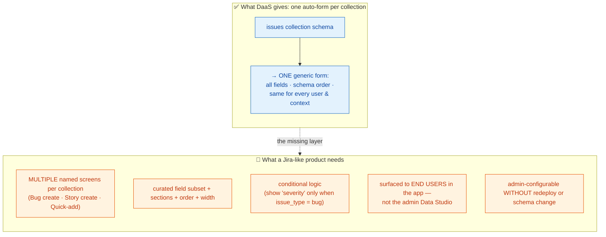

So a single field's interface metadata can't say *"this field is on the Bug screen but not the Story screen,"*
or *"required here, hidden there."* That per-screen configuration has nowhere to live in DaaS today — and the
"obvious" places to put it are all wrong:

| What's missing | Why the obvious fix fails |
|----------------|---------------------------|
| **Multiple named screens per collection** (per issue-type, per workflow step). | Field-level interface metadata is one-per-field; it can't express "appears on screen A, not B." |
| **Per-screen field selection / order / layout / conditions.** | Encoding it by **mutating the schema** breaks the single shared collection and isn't reversible per-screen — one `issues` collection needs *many* screens. |
| **A place to store screen configs.** | Can't introduce a `daas_`/system collection (`daas_*` is reserved); it must live in **ordinary, consumer-owned** data. |
| **End-user-facing forms, in your app.** | The DaaS Data Studio auto-form is an admin surface; the product's create/edit screens live in the consumer app. |
| **Keep DaaS permissions, validation & multi-tenant scopes.** | A bespoke renderer would re-implement (and likely violate) RLS/RBAC, server validation, and scope isolation. |

### Problem statement

> DaaS already renders *a* form for any collection. To build something like Jira on top of it, let an
> **admin visually author multiple named, reusable "screens"** (curated fields, order, width,
> required/readonly, sections, and conditional rules) per collection, and have **end users fill them at
> runtime** — **without writing code, without mutating the platform schema, without a system collection, and
> without weakening DaaS permissions or multi-tenant scopes.**

---

## 0.1 Solution overview — the overlay model

The core idea is an **overlay**: store a small JSON **form definition** as an ordinary item, and at render
time **merge it onto the collection's live schema** to produce the `Field[]` the *existing* runtime already
knows how to render. The schema is never touched *by the overlay* (the builder may *additively* provision
real fields separately — §4.5); many named screens can coexist; and because the merged
fields flow through the unchanged `CollectionForm`/`VForm`, every permission, validation, and scope behavior
is inherited for free.

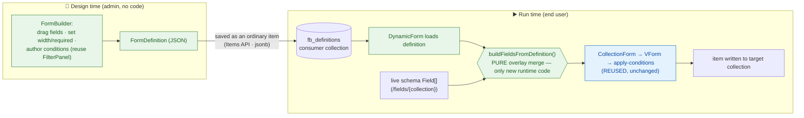

**Design principle: reuse the runtime; lean into the platform for storage.** No new form renderer, no new
condition engine. The overlay never *mutates* the schema — but the builder *does* additively **provision**
real fields/collections via the DaaS **DDL API** so answers are stored as real, searchable columns (with a
single `extras` jsonb column as the opt-in non-searchable tail). The deliverables are: (1) a builder UI,
(2) one **pure merge function**, (3) a thin data hook over the Items API, (4) a **schema write-service +
DDL proxy routes** and a **hybrid split** in `CollectionForm`, (5) registry/CLI packaging — and how each
maps to the requirements:

| Gap (above) | How the solution answers it | Diagram |
|-------------|-----------------------------|---------|
| Multiple named screens per collection | Each screen is one `FormDefinition` item; many can target the same collection (optionally keyed by issue-type). | §1, §3 |
| Per-screen fields/order/layout/conditions | Captured in the definition JSON; admins author it visually — changes are data, not deploys. | §3 |
| Overlay never mutates the schema | Definition is an **overlay** merged in-memory onto the live schema; existing fields/data are untouched. | §5 |
| **Searchable answer storage (not a blob)** | Answers are **real columns** (the builder **provisions** them via the DDL API, optionally indexed) → native Items `filter`/`search`/`aggregate`; opt-in `extras` jsonb for the non-searchable tail. | §4.5, §8 |
| No system collection | Stored as items in a consumer collection (default `fb_definitions`). | §1, §7 |
| End-user-facing, permissions/validation intact | Merged `Field[]` flows through the **unchanged** `CollectionForm`/`VForm` in the consumer app. | §4 |
| Multi-tenant scopes | "Scope the data, share the config" — global baseline + optional per-tenant override. | §6 |
| Adoptable without re-engineering | Shipped as a shadcn-registry package; `buildpad add form-builder`. | §7 |

---

## 1. Where the form builder sits in the DaaS stack (C4-ish context)

The feature lives in the **Application Layer** only. `useFormDefinitions` and the `CollectionForm` data
layer use the **same Items API + Permissions** that every DaaS client uses. At **authoring time**, the
builder additionally calls the **Schema API (DDL)** to *provision* the target collection and real fields
on demand (`FieldsService`/`CollectionsService` write methods + new proxy routes) — gated on schema
rights. At **fill time**, answers are written as real items (real columns + an `extras` jsonb tail) and
are queryable through the Items API like any other collection.

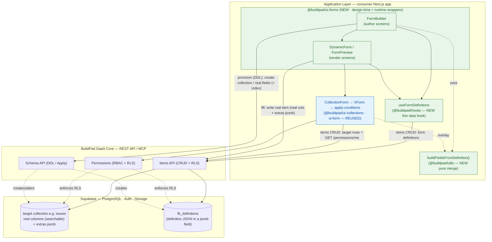

> **Architect takeaway:** the only genuinely new runtime code is a *pure function* (`buildFieldsFromDefinition`).
> Everything else is either a thin data hook over the Items API or a UI that produces/consumes JSON.

---

## 2. Module map — what's new vs. reused

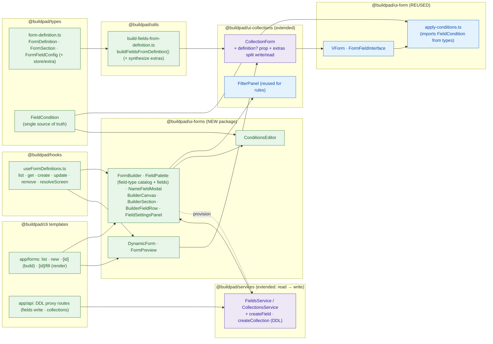

---

## 3. Design-time — admin authors a screen (sequence)

```mermaid
sequenceDiagram
    autonumber
    actor Admin
    participant FB as FormBuilder (ui-forms)
    participant Hook as useFormDefinitions
    participant Items as DaaS Items API
    participant FP as FilterPanel (conditions)
    participant Prev as FormPreview / DynamicForm

    Admin->>FB: open builder for target collection
    FB->>Items: FieldsService.readAll(targetCollection)
    Items-->>FB: live schema Field[]
    FB->>Hook: get(definitionId)  (or start blank)
    Hook->>Items: GET /items/fb_definitions/{id}
    Items-->>Hook: FormDefinition (or none)
    Hook-->>FB: definition

    Note over FB: field-type catalog + unplaced fields → palette
    Admin->>FB: drag existing field → canvas (dnd-kit); or drag a type chip → name prompt → new field
    Admin->>FB: set width/required/readonly, label/choices, add/rename sections
    Admin->>FP: build rule (e.g. issue_type _eq bug)
    FP-->>FB: DaaS filter JSON → FieldCondition[]

    Admin->>Prev: preview tab
    Prev->>Prev: buildFieldsFromDefinition(schema, def) → render against empty values
    Prev-->>Admin: live layout + conditional behavior

    Admin->>FB: Save
    FB->>Hook: create/update(definition)
    Hook->>Items: POST/PATCH /items/fb_definitions  (definition JSON in jsonb)
    Items-->>Hook: saved item
    Hook-->>FB: onSaved(def)
```

---

## 4. Runtime — end user fills the configured form (sequence)

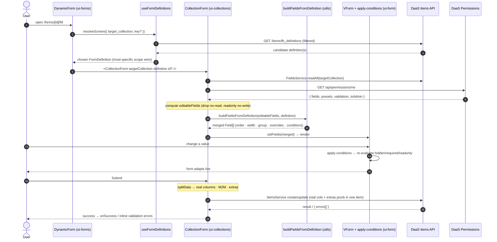

---

## 4.5 Storage — provisioning (DDL) + the write path (hybrid + full)

Answers are stored as **real columns** (searchable) by default; the builder provisions those columns via
the **DDL API**. Two strategies (Req 12), chosen when the screen's target collection comes to be: binding to
an **existing** collection is **hybrid** (real columns + a single opt-in `extras` jsonb tail); having the
builder **create a new** collection is **full** (standard system fields + all real columns, **no** `extras`).
Every builder-created collection is named with the configurable `fb_` prefix.

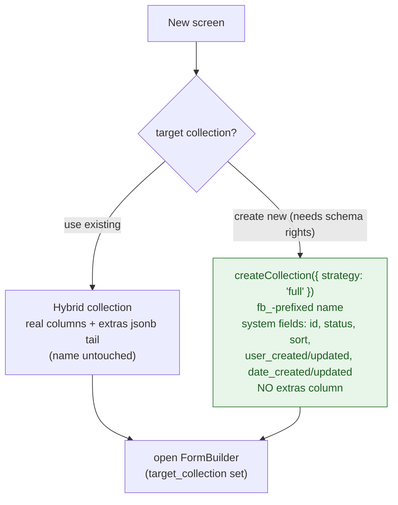

```mermaid
sequenceDiagram
    autonumber
    actor Admin
    participant FB as FormBuilder
    participant SVC as FieldsService/CollectionsService (DDL)
    participant Schema as DaaS Schema API
    Admin->>FB: drag catalog chip → NameFieldModal (column name only)
    Note over FB: synth Field + hold FieldSpec in pendingSpecs (name locked);<br/>label/choices edited later in FieldSettingsPanel
    Admin->>FB: Save
    alt new collection (auto-create)
        FB->>SVC: createCollection({ strategy: 'full' })<br/>(fb_-prefixed; system fields, no extras)
        SVC->>Schema: POST /api/collections
    end
    loop each still-placed pending spec (bound OR new collection)
        FB->>SVC: createField(collection, spec)  (add_index if filterable)
        SVC->>Schema: POST /api/fields/{collection}
        Schema-->>SVC: created Field (real column)
        SVC-->>FB: replace synth → real field → overlay
    end
    Note over FB: block save if a pending choice field has no choices<br/>or a pending name is invalid/duplicate
    Note over FB: advanced "Add field" also offers Extra (jsonb, hybrid only)<br/>— no DDL; descriptor kept in the definition
```

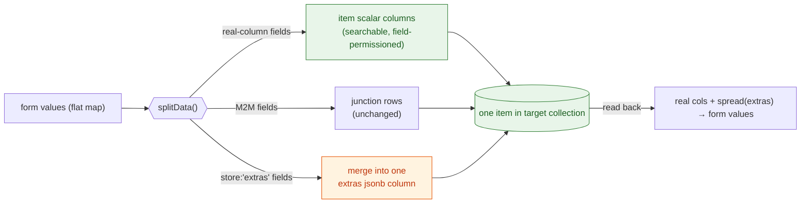

---

## 5. The overlay merge — definition + live schema → `Field[]`

The heart of the feature. The schema is **never mutated**; the definition is a thin overlay merged into
in-memory `Field.meta` at render time.

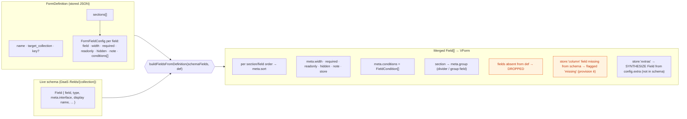

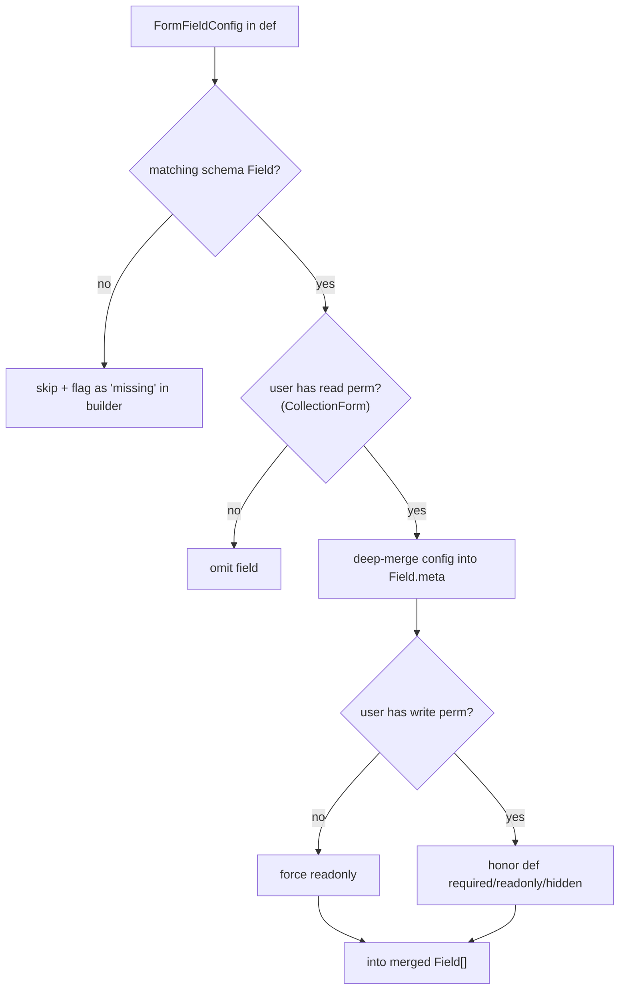

---

## 6. Multi-tenant scope resolution — "scope the data, share the config"

Default: `fb_definitions` is **non-scope-enabled**, so one authored screen is a **global baseline** for
every tenant. A consumer can later scope-enable it (with `inheritance_mode: down`) to allow per-tenant
overrides — **no code change**, only a resolution sort/pick.

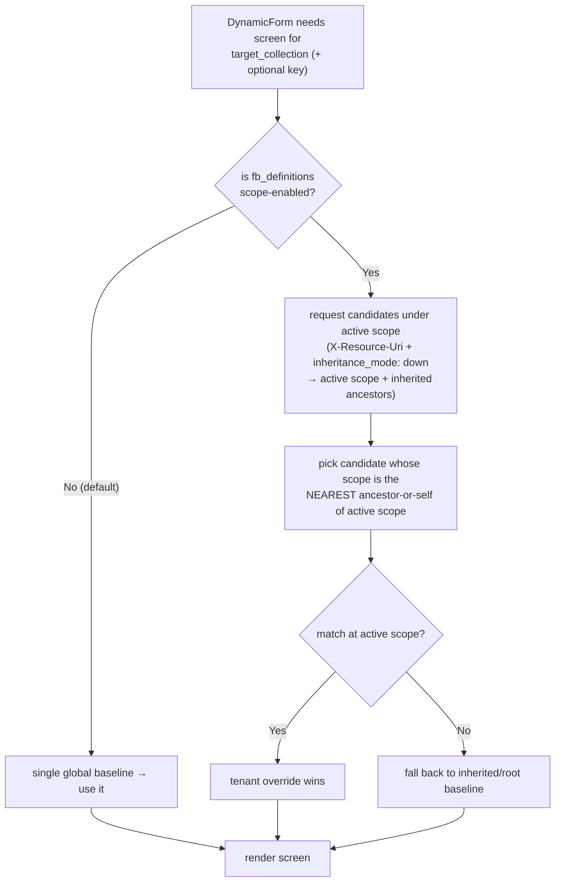

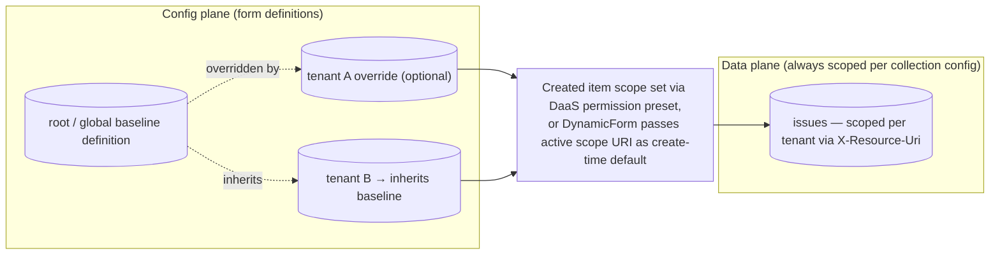

> **Proxy caveat (pre-existing repo limitation):** the shipped Next.js `/api/items` proxy forwards
> `Authorization` + `Content-Type` only, **not** `X-Resource-Uri`. Direct DaaS calls (the default path via
> `DaaSProvider`) inject the scope header correctly; a consumer using proxy mode with scope-enabled
> collections must extend the proxy to forward it.

---

## 7. Packaging / distribution (shadcn-registry, mirrors `@buildpad/ui-files`)

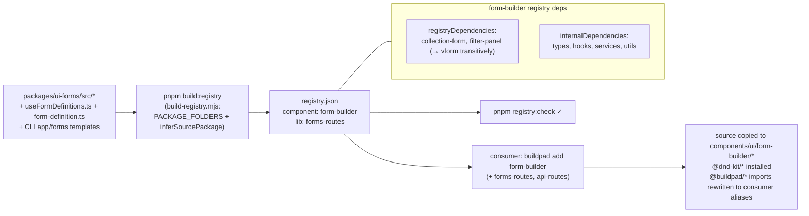

---

## 8. Searchability & ecosystem fit — why real columns

Because answers are real columns, the form data is consumed natively by the rest of buildpad; the
`extras` jsonb tail is the only thing that opts out of search.

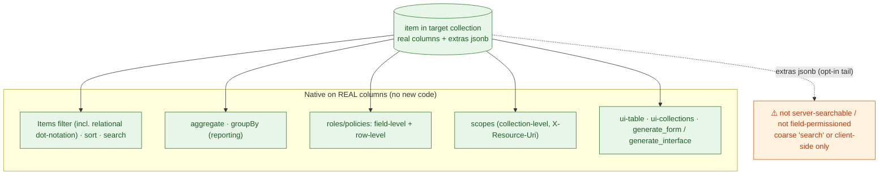

> **Why not a blob or EAV (see `design.md → Data storage & searchability`):** DaaS can't filter inside a
> JSON column, so a `data.json` blob isn't searchable here; EAV would forfeit field-level permissions and
> native relational/aggregate queries and break `ui-table`/codegen. Real columns via the DDL API give
> both flexibility *and* search — the buildpad-native answer.

---

## 9. Data model — classic EAV vs. the proposed hybrid (ERD)

Two ways to store flexible, per-screen issue data. The classic engine (Jira-style) makes every custom
field a **row** in a value-table and pushes search to an external index; the proposed design makes every
field a **real column** (provisioned via the DDL API) so DaaS *is* the search/permission layer.

### 9a. Classic engine — EAV + external search index

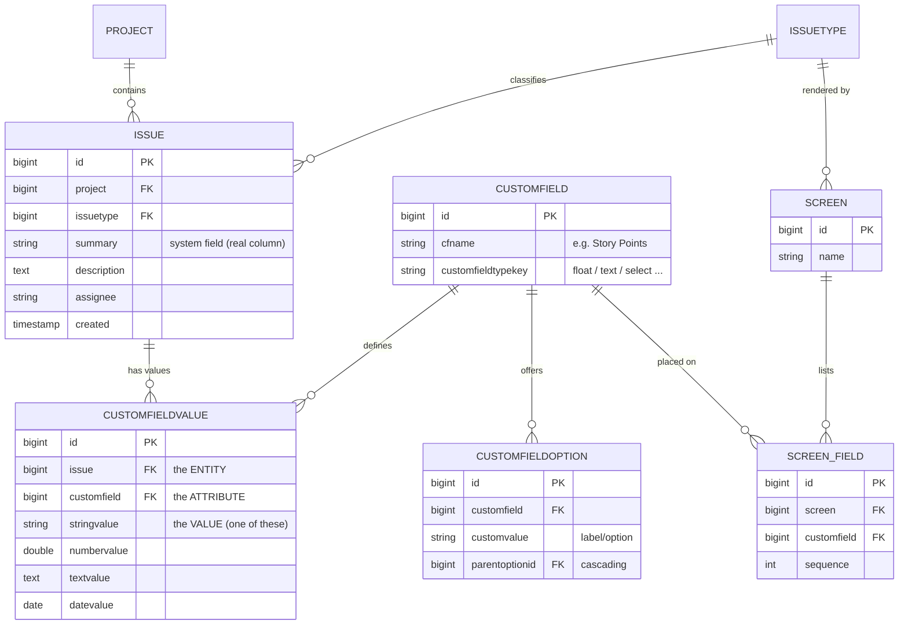

> **+ a Lucene index (not a DB table).** Because querying `CUSTOMFIELDVALUE` means deep self-joins
> (`budget > 4000 AND status = 'In Progress'` = a join per attribute), every issue write is *also* written
> to an external **Lucene** index; search/JQL hits Lucene, not the database. Flexible, but you own the
> index, the EAV joins, weak typing (generic value columns), and relations-as-bare-ids.

### 9b. Proposed — real columns + relations (+ `extras` jsonb tail)

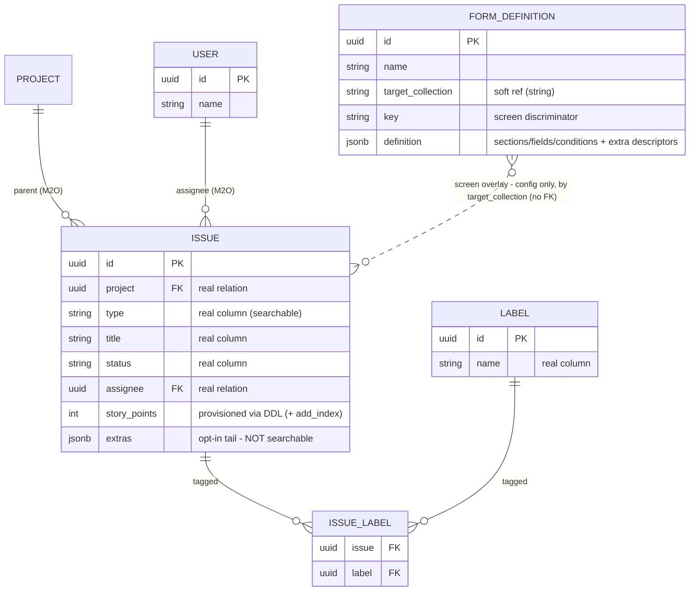

> **No value-table, no external index.** Each field is a real column on `ISSUE`, so search is the native
> Items API (`filter`/relational dot-notation/`sort`/`search`/`aggregate`/`groupBy`); relations are real
> FKs/junctions (`project`, `assignee`, `labels`); permissions are field-level. The **screen** is config
> in `FORM_DEFINITION` (a soft, by-name overlay — not a FK). Only the opt-in `extras` jsonb opts out of
> search.

### 9c. Full storage — a builder-created collection (no `extras`)

The **full** strategy (Req 12) is 9b without the escape hatch: the builder *creates* the collection with the
standard audit **system fields** and provisions every custom field as a real column, so there is **no**
`extras` jsonb column at all — the whole record is searchable.

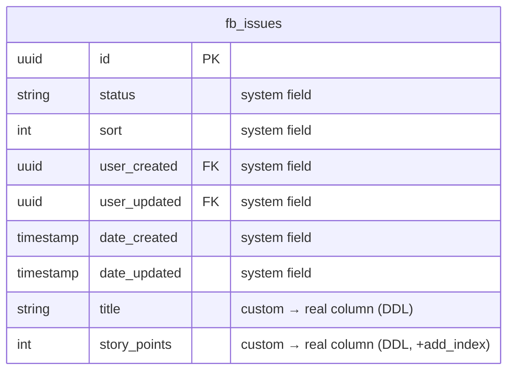

> Contrast with 9b's hybrid `ISSUE`, which keeps an `extras` jsonb tail for non-searchable fields. In a full
> collection every field is a column, so the *Extra* store option is unavailable. The collection name is
> `fb_`-prefixed (`fb_issues`) to mark it builder-owned.

### What changed, row by row

| Classic (EAV) | Proposed (hybrid) |
|---------------|-------------------|
| `CUSTOMFIELD` + `CUSTOMFIELDVALUE` (1 value-row per field per issue) | **real columns on `ISSUE`** (provisioned via DDL, optionally indexed) |
| `CUSTOMFIELDOPTION` cascade tables | interface `options` on the field's `meta` (or a related collection for big lists) |
| `SCREEN` + `SCREEN_FIELD` join tables | `FORM_DEFINITION.definition` jsonb (overlay) |
| relations stored as ids inside `stringvalue` | real **FK relations** + native **M2M** junctions |
| external **Lucene** index, rebuilt on every write | native **Items API** query surface — nothing to maintain |
| field access enforced in app code | native **field-level** DaaS permissions |
| — | `extras` jsonb for the rare non-searchable tail (opt-in) — **hybrid** only |
| — | **full** strategy (builder-created collection): standard system fields + every field a real column, **no** `extras` |

---

## Legend

| Style | Meaning |
|-------|---------|
| 🟩 green | **New** code shipped by this feature |
| 🟦 blue | **Reused** existing runtime (no/minimal change) |
| 🟪 purple | **Extended** existing code (CollectionForm split, services DDL) |
| 🟧 orange | **Caveat** — the `extras` jsonb tail (not searchable) |

Answer persistence is ordinary **items in a user collection** through the **DaaS Items API** (real
columns + an `extras` jsonb tail) — consistent with the platform's three-tier model. The feature adds **no
new tier**; it does add **DDL proxy routes** for provisioning and **additively** creates schema via the
managed DDL API (never mutating existing data).
