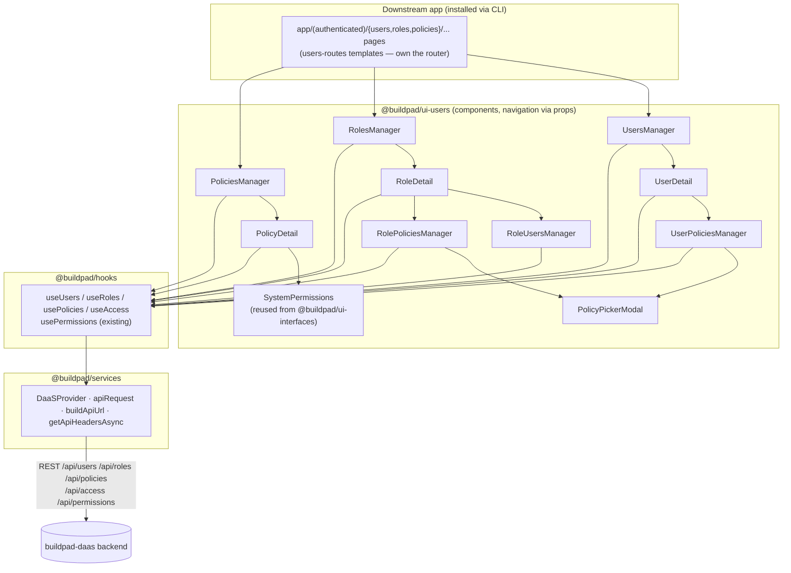

# Design Document

## Overview

`@buildpad/ui-users` is a new monorepo package providing the users/roles/policies administration surface for DaaS-backed apps. It ports the reference admin UI from the buildpad-daas repo (`app/users`, `app/roles`, `app/policies` and their supporting components) into the buildpad-ui package conventions established by `packages/ui-files`: flat presentational Mantine v8 components, data via `@buildpad/hooks`, transport via `@buildpad/services`, types via `@buildpad/types`, distribution via the CLI registry (source copy), stories colocated, docs in Nextra.

One package (not three) because the three domains are mutually referential: `UserDetail` manages attached policies, `RoleDetail` manages member users and attached policies, `PolicyDetail` displays user/role counts. Splitting would force a fourth shared package or circular dependencies.

## Architecture

### Layering



Key rules:

- Components never import `next/navigation`; navigation is prop-injected (`onUserClick`, `onBack`, `onDeleted`, `onSaved`, `onCreate*`). The `users-routes` CLI templates own the router wiring, exactly like `templates/app/files`.
- Components never call `fetch` directly; all I/O goes through the new hooks, which use `apiRequest` (auth headers via `getApiHeadersAsync` — this is what avoids the historical `usePermissions` getToken bug; never read `config.token`).
- Action affordances are gated with the existing `usePermissions` hook using the ui-files optimistic pattern: `permsLoading || isAdmin || canPerform(collection, action)`.

### Backend API contract (buildpad-daas, Directus-compatible)

| Domain | Endpoints used | Notes |
|---|---|---|
| Users | `GET/POST /api/users`, `GET/PATCH/DELETE /api/users/[id]`, `GET/PATCH /api/users/me`, `PATCH /api/users/bulk-update`, `GET/POST /api/users/[id]/policies`, `DELETE /api/users/[id]/policies/[policyId]` | `roles` is M2M via `daas_user_roles`; list supports `page/pageSize/search/role/status/fields`; `admin_access` computed — never write |
| Roles | `GET/POST /api/roles` (`includeUsers=true` → `users:[{count}]`), `GET/PATCH/DELETE /api/roles/[id]` (`includePolicies=true`), `GET /api/roles/me`, `GET/POST /api/roles/[id]/policies`, `DELETE /api/roles/[id]/policies/[policyId]` | `parent` self-FK hierarchy (no tree endpoint — client builds it); `scope_config` validated server-side as regex list |
| Policies | `GET/POST /api/policies`, `GET/PATCH/DELETE /api/policies/[id]`, `GET /api/policies/me` | List/detail enriched with `userCount`/`roleCount`; flags `admin_access`, `app_access`, `delegate_access` |
| Access | `GET/POST /api/access`, `GET/PATCH/DELETE /api/access/[id]` | Junction: `policy` + (`role` XOR `user`) + `sort`; exposed via `useAccess` for advanced consumers, components use the nested routes above |
| Permissions | `GET/POST/PATCH/DELETE /api/permissions`, `?policy=` filter | Driven by the reused `SystemPermissions` component |

List envelope: `{ data, count, totalCount, page, pageSize, totalPages }` (page-based, not offset). Errors arrive in two shapes — `{ error }` and Directus `{ errors: [{ message, extensions: { code } }] }` — normalized by a shared `parseDaaSError` helper in hooks.

## Components and Interfaces

### New hooks (`packages/hooks/src/`)

Follow `useFiles.ts` conventions: `'use client'`, `useState` loading/error, `useCallback` methods, `apiRequest` transport.

```ts
// useUsers.ts
interface FetchUsersParams { page?: number; limit?: number; search?: string; sort?: string;
  fields?: string; role?: string; status?: UserStatus; filter?: Record<string, unknown>; }
interface UsersListResult { users: User[]; total: number; totalPages: number; }
useUsers(): {
  loading: boolean; error: string | null;
  fetchUsers(params?: FetchUsersParams): Promise<UsersListResult>;
  getUser(id: string, opts?: { fields?: string }): Promise<User>;
  getMe(): Promise<User>;
  createUser(data: Partial<User> & { email: string }): Promise<User>;
  updateUser(id: string, data: Partial<User>): Promise<User>;      // strips admin_access
  updateMe(data: Partial<User>): Promise<User>;
  deleteUser(id: string): Promise<void>;
  bulkUpdateUsers(ids: string[], change: { role?: string; addRoles?: string[]; removeRoles?: string[] }): Promise<void>;
  fetchUserPolicies(userId: string): Promise<Access[]>;
  attachUserPolicy(userId: string, policyId: string): Promise<void>;
  detachUserPolicy(userId: string, policyId: string): Promise<void>;
}

// useRoles.ts
useRoles(): {
  fetchRoles(params?: { page?; limit?; search?; sort?; includeUsers?: boolean }): Promise<{ roles: Role[]; total; totalPages }>;
  getRole(id: string, opts?: { includePolicies?: boolean }): Promise<Role>;
  getMyRoles(): Promise<Role[]>;
  createRole(data: Partial<Role> & { name: string }): Promise<Role>;
  updateRole(id, data): Promise<Role>; deleteRole(id): Promise<void>;
  fetchRolePolicies(roleId): Promise<Access[]>;
  attachRolePolicy(roleId, policyId): Promise<void>; detachRolePolicy(roleId, policyId): Promise<void>;
  loading; error;
}

// usePolicies.ts
usePolicies(): {
  fetchPolicies(params?: { page?; limit?; search?; sort? }): Promise<{ policies: Policy[]; total; totalPages }>;
  getPolicy(id): Promise<Policy>; getMyPolicies(): Promise<Policy[]>;
  createPolicy(data: Partial<Policy> & { name: string }): Promise<Policy>;
  updatePolicy(id, data): Promise<Policy>; deletePolicy(id): Promise<void>;
  loading; error;
}

// useAccess.ts — thin junction CRUD for advanced consumers
useAccess(): { fetchAccess(params?): Promise<Access[]>; createAccess(data): Promise<Access>;
  updateAccess(id, data): Promise<Access>; deleteAccess(id): Promise<void>; loading; error; }
```

### Package components (`packages/ui-users/src/`, flat like ui-files)

| Component | Ported from (buildpad-daas) | Design notes |
|---|---|---|
| `UsersManager` (+`.css`) | `app/users/page.tsx` | Mantine `Table`; debounced search; role filter (fed by `useRoles`); status filter; pagination; `UserAvatar` initials; role `Badge`s; `UserStatusBadge`; row menu (edit/delete). Props: `onUserClick?`, `onCreateUser?`, `pageSize?`, `usersCollection?='daas_users'` |
| `UserDetail` | `app/users/[id]/page.tsx` | Tabs Basic/Policies. Explicit Mantine fields (not schema-driven DynamicForm — self-contained after CLI copy): email, password (create-only, min 6), first/last name, title, description, location, `TagsInput`, language/theme/status `Select`s, masked token field, roles `MultiSelect` (M2M normalized to ID array). Edits-only PATCH; dirty tracking disables Save; `InfoPanel` sidebar. Props: `id`, `onBack?`, `onDeleted?`, `onSaved?`, `usersCollection?` |
| `RolesManager` | `app/roles/page.tsx` | Search, icon, user count (`includeUsers=true` → `users[0].count`), description, row menu. Props: `onRoleClick?`, `onCreateRole?`, `pageSize?`, `rolesCollection?` |
| `RoleDetail` | `app/roles/[id]/page.tsx` | Tabs Basic/Users/Policies (Users+Policies hidden when new). Basic: name, `SelectIcon`, description, parent-role `Select` (excludes self), **scope_config editor** (enable `Switch` → regex pattern rows with live `new RegExp` validity check + add/remove + validation-message input; disable → `null`). Save `Menu` (Stay/Quit/Add New/Discard); unsaved-changes navigation guard `Modal`; `InfoPanel` |
| `PoliciesManager` | `app/policies/page.tsx` | Search, icon, name, description, userCount, roleCount, row menu. Props: `onPolicyClick?`, `onCreatePolicy?`, `pageSize?`, `policiesCollection?` |
| `PolicyDetail` | `app/policies/[id]/page.tsx` | Basic info + Access Control `Switch`es (`app_access`, `admin_access`, `delegate_access`) + permissions matrix via **`SystemPermissions`** (`@buildpad/ui-interfaces/system-permissions`; alterations batched, applied to `/api/permissions` on Save). Combined dirty tracking (form + matrix) drives "Unsaved Changes" badge + Save enablement; `InfoPanel` |
| `UserPoliciesManager` | `components/UserPoliciesManager.tsx` | Attached-policy list + attach/detach via `useUsers`; `onUpdate` callback refreshes parent counts |
| `RolePoliciesManager` | `components/RolePoliciesManager.tsx` | Same via `useRoles` |
| `RoleUsersManager` | `components/RoleUsersManager.tsx` | Lists `fetchUsers({ role })`; add/remove membership via `bulkUpdateUsers` `addRoles`/`removeRoles` |
| `PolicyPickerModal` | new (dedupe of the two managers' pickers) | Searchable policy list excluding already-attached IDs |
| `UserStatusBadge` | extracted | status→color: active=green, invited=blue, draft=gray, suspended=red, terminated=orange (match daas `STATUS_COLORS`) |
| `UserAvatar` | extracted | Initials from first/last name, fallback email prefix |
| `InfoPanel` | merge of `InfoSidebar`/`RoleInfoSidebar` | Generic label/value rows + description |
| `DeleteConfirmModal` | local copy | Per-package convention (ui-files ships its own too) |
| `_fixtures.ts`, `index.ts`, `css.d.ts` | new | Story fixtures; pure export barrel; CSS module shim |

**Reused instead of ported:** `SystemPermissions` (replaces the daas `PermissionsTable` + Row/Toggle/Fields/Filter/Presets/Validation/DetailModal family), `SelectIcon` (replaces `IconPicker`/`IconDisplay`), inline `TextInput`+`IconSearch` (replaces `SearchInput`). The `system-token` interface is evaluated for the token field; fallback is a masked `TextInput` with a regenerate action.

**Explicitly out of scope (matches daas parity boundary):** avatar upload (daas excludes `avatar` from its own form), invite emails (no backend endpoint; invite = `status: 'invited'`), writes to `admin_access`, `auth_data`, `provider`, `external_identifier`, `last_page`, `tfa_secret`.

## Data Models

New `packages/types/src/users.ts` (re-exported from `index.ts`; existing `DaaSUser` interfaces untouched):

```ts
export type UserStatus = 'active' | 'suspended' | 'invited' | 'draft' | 'terminated';

export interface User {
  id: string;
  email: string;
  password?: string;                 // write-only (create / reset)
  first_name: string | null;
  last_name: string | null;
  title?: string | null;
  description?: string | null;
  location?: string | null;
  tags?: string[] | null;
  language?: string | null;
  theme?: string | null;
  status: UserStatus;
  token?: string | null;
  last_access?: string | null;
  roles?: Array<string | { id: string; name: string; icon?: string | null }>; // M2M via daas_user_roles
  readonly admin_access?: boolean;   // computed from policies — NEVER write
  created_at?: string;
  updated_at?: string;
}

export interface RoleScopeConfig { allowed_scopes: string[]; validation_message?: string; }

export interface Role {
  id: string;
  name: string;
  icon?: string | null;
  description?: string | null;
  parent?: string | null;                 // self-FK hierarchy
  scope_config?: RoleScopeConfig | null;
  users?: Array<{ count?: number }>;      // when includeUsers=true
  policies?: Access[];                    // when includePolicies=true
  created_at?: string;
  updated_at?: string;
}

export interface Policy {
  id: string;
  name: string;
  icon?: string | null;
  description?: string | null;
  admin_access: boolean;
  app_access: boolean;
  delegate_access?: boolean;
  userCount?: number;                     // list/detail enrichment
  roleCount?: number;
  created_at?: string;
  updated_at?: string;
}

export interface Access {                 // daas_access junction: policy + (role XOR user)
  id: string;
  policy: string | Policy;
  role?: string | Role | null;
  user?: string | User | null;
  sort?: number | null;
}

export interface ListMeta { count: number; totalCount: number; page: number; pageSize: number; totalPages: number; }
```

## Error Handling

- `apiRequest` throws `API error: {status} - {rawBody}`; hooks wrap calls and run the message through `parseDaaSError(err)`, which attempts to parse the embedded JSON body in both backend shapes (`{ error }` and `{ errors: [{ message }] }`) and falls back to the raw message.
- Components surface hook errors as Mantine notifications (`notifications.show({ color: 'red', ... })`) matching the daas UX, and keep the UI interactive (no crash states).
- Destructive actions (delete user/role/policy, detach policy) always route through `DeleteConfirmModal`/confirm dialogs.
- Client-side validation before save: required email/name, password presence (create) and min length 6, live regex validity for scope patterns (invalid patterns block save).

## Distribution (registry + CLI)

1. `scripts/build-registry.mjs`: add `'@buildpad/ui-users': 'ui-users'` to `PACKAGE_FOLDERS` (~line 45) and an `ui-users/` branch in `inferSourcePackage()` (~line 153).
2. `packages/registry.template.json`:
   - Component `users-management` (category `admin`, `excludeFromAll: true`, modeled on `file-manager` ~line 2443): one entry per `ui-users/src/*` file → `components/ui/users-management/<kebab>.*`; `dependencies`: `@mantine/core|hooks|notifications`, `@tabler/icons-react`; `internalDependencies`: `["types","hooks","services"]`; `registryDependencies`: `["system-permissions","select-icon"]`.
   - Lib module `users-routes` (modeled on `files-routes` ~line 477): six templates → `app/(authenticated)/{users,roles,policies}/page.tsx` + `[id]/page.tsx`; `registryDependencies: ["users-management"]`; `internalDependencies: ["api-routes","hooks"]`.
   - Append the four hook files to the `hooks` lib-module file list.
3. `packages/cli/templates/app/{users,roles,policies}/`: thin `'use client'` pages wiring router→props, e.g. `<UsersManager onUserClick={(u) => router.push(`/users/${u.id}`)} onCreateUser={() => router.push('/users/new')} />`; detail pages read `useParams().id` (with `'new'` sentinel for create) and pass `onBack`/`onDeleted` → `router.push('/users')`.
4. `packages/cli/templates/lib/hooks/index.ts`: export the four new hooks.

## Storybook

- Package `.storybook/` copied from ui-files: self-alias `@buildpad/ui-users` → `../src`, sibling `@buildpad/*` → `../../<pkg>/src`, `/api` proxy → `http://localhost:3000`, enterprise theme preview; dev port **6011** (6005–6010 taken).
- Fixture stories (`*.stories.tsx` + `_fixtures.ts`) for presentational pieces; live `*.daas.stories.tsx` for the six surfaces, scaffolded from `FileManager.daas.stories.tsx` (DaaSProvider with proxy config).
- Root `package.json` gains `storybook:users`; `scripts/build-storybooks.sh` gains the ui-users build step; storybook-host landing links updated.

## Testing Strategy

- **Unit (vitest, ui-users):** pure helpers — initials derivation, status→color map, parent-role self-exclusion, roles M2M ID-normalization, scope-pattern regex validation.
- **Unit (vitest, hooks):** query-string construction for each fetch method; `parseDaaSError` on both error shapes; mocked `fetch`.
- **Live verification:** buildpad-daas on `localhost:3000` → `pnpm storybook:users` → exercise `.daas` stories end-to-end: create user (invited), assign roles, attach policies to user and role, edit role with scope patterns, toggle policy flags + matrix cells (verify `GET /api/users/[id]/policies`, `/api/permissions?policy=`), delete flows, non-admin token for RBAC gating.
- **Registry integrity:** `pnpm build:registry && pnpm registry:check`; scratch consumer app `buildpad add users-routes` → dependency chain resolves and pages compile.
- **E2E (stretch, may be follow-up):** `playwright.users.config.ts` mirroring `playwright.files.config.ts` with `users-api` and `users-storybook` projects plus RBAC setup/teardown helpers under `tests/ui-users/helpers/`.

## Release

Add `@buildpad/ui-users` to the `.changeset/config.json` `fixed` group; one minor changeset releases everything in lockstep (1.6.0 → 1.7.0). Watch the known changesets peerDep major-cascade issue (workspace:* peerDeps inflate to major) and rewrite the version down if needed. UI packages are not published to npm — consumers fetch source from GitHub main via the registry.

## Key reference files

- `packages/hooks/src/useFiles.ts` — hook conventions template
- `packages/ui-files/{package.json, tsconfig.json, src/index.ts, src/FileManager.tsx, .storybook/main.ts}` — package/component/navigation template
- `packages/ui-interfaces/src/system-permissions/SystemPermissions.tsx` — reused permissions matrix
- `packages/registry.template.json` (`file-manager` ~2443, `files-routes` ~477) and `scripts/build-registry.mjs` (~45, ~153)
- buildpad-daas sources to port: `app/{users,roles,policies}/page.tsx` + `[id]/page.tsx`; `components/{UserPoliciesManager,RolePoliciesManager,RoleUsersManager,InfoSidebar,RoleInfoSidebar,DeleteConfirmModal}.tsx`
