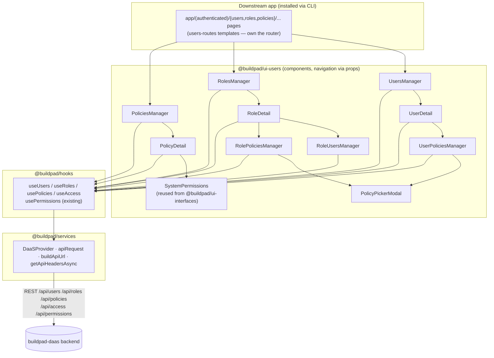

# Design Document

## Overview

`@buildpad/ui-users` is a new monorepo package providing the users/roles/policies administration surface for DaaS-backed apps. It ports the reference admin UI from the buildpad-daas repo (`app/users`, `app/roles`, `app/policies` and their supporting components) into the buildpad-ui package conventions established by `packages/ui-files`: flat presentational Mantine v8 components, data via `@buildpad/hooks`, transport via `@buildpad/services`, types via `@buildpad/types`, distribution via the CLI registry (source copy), stories colocated, docs in Nextra.

One package (not three) because the three domains are mutually referential: `UserDetail` manages attached policies, `RoleDetail` manages member users and attached policies, `PolicyDetail` displays user/role counts. Splitting would force a fourth shared package or circular dependencies.

## Architecture

### Layering



Key rules:

- Components never import `next/navigation`; navigation is prop-injected (`onUserClick`, `onBack`, `onDeleted`, `onSaved`, `onCreate*`). The `users-routes` CLI templates own the router wiring, exactly like `templates/app/files`.
- Components never call `fetch` directly; all I/O goes through the new hooks, which use `apiRequest` (auth headers via `getApiHeadersAsync` — this is what avoids the historical `usePermissions` getToken bug; never read `config.token`).
- Action affordances are gated with the existing `usePermissions` hook using the ui-files optimistic pattern: `permsLoading || isAdmin || canPerform(collection, action)`.

### Backend API contract (buildpad-daas, DaaS-compatible)

| Domain | Endpoints used | Notes |
|---|---|---|
| Users | `GET/POST /api/users`, `GET/PATCH/DELETE /api/users/[id]`, `GET/PATCH /api/users/me`, `PATCH /api/users/bulk-update`, `GET/POST /api/users/[id]/policies`, `DELETE /api/users/[id]/policies/[policyId]` | `roles` is M2M via `daas_user_roles`; list supports `page/pageSize/search/role/status/fields`; `admin_access` computed — never write |
| Roles | `GET/POST /api/roles` (`includeUsers=true` → `users:[{count}]`), `GET/PATCH/DELETE /api/roles/[id]` (`includePolicies=true`), `GET /api/roles/me`, `GET/POST /api/roles/[id]/policies`, `DELETE /api/roles/[id]/policies/[policyId]` | `parent` self-FK hierarchy (no tree endpoint — client builds it); `scope_config` validated server-side as regex list |
| Policies | `GET/POST /api/policies`, `GET/PATCH/DELETE /api/policies/[id]`, `GET /api/policies/me` | List/detail enriched with `userCount`/`roleCount`; flags `admin_access`, `app_access`, `delegate_access` |
| Access | `GET/POST /api/access`, `GET/PATCH/DELETE /api/access/[id]` | Junction: `policy` + (`role` XOR `user`) + `sort`; exposed via `useAccess` for advanced consumers, components use the nested routes above |
| Permissions | `GET/POST/PATCH/DELETE /api/permissions`, `?policy=` filter | Driven by the reused `SystemPermissions` component |

List envelope: `{ data, count, totalCount, page, pageSize, totalPages }` (page-based, not offset). Errors arrive in two shapes — `{ error }` and DaaS `{ errors: [{ message, extensions: { code } }] }` — normalized by a shared `parseDaaSError` helper in hooks.

## Components and Interfaces

### New hooks (`packages/hooks/src/`)

Follow `useFiles.ts` conventions: `'use client'`, `useState` loading/error, `useCallback` methods, `apiRequest` transport.

```ts
// useUsers.ts
interface FetchUsersParams { page?: number; limit?: number; search?: string; sort?: string;
  fields?: string; role?: string; status?: UserStatus; filter?: Record<string, unknown>; }
interface UsersListResult { users: User[]; total: number; totalPages: number; }
useUsers(): {
  loading: boolean; error: string | null;
  fetchUsers(params?: FetchUsersParams): Promise<UsersListResult>;
  getUser(id: string, opts?: { fields?: string }): Promise<User>;
  getMe(): Promise<User>;
  createUser(data: Partial<User> & { email: string }): Promise<User>;
  updateUser(id: string, data: Partial<User>): Promise<User>;      // strips admin_access
  updateMe(data: Partial<User>): Promise<User>;
  deleteUser(id: string): Promise<void>;
  bulkUpdateUsers(ids: string[], change: { role?: string; addRoles?: string[]; removeRoles?: string[] }): Promise<void>;
  fetchUserPolicies(userId: string): Promise<Access[]>;
  attachUserPolicy(userId: string, policyId: string): Promise<void>;
  detachUserPolicy(userId: string, policyId: string): Promise<void>;
}

// useRoles.ts
useRoles(): {
  fetchRoles(params?: { page?; limit?; search?; sort?; includeUsers?: boolean }): Promise<{ roles: Role[]; total; totalPages }>;
  getRole(id: string, opts?: { includePolicies?: boolean }): Promise<Role>;
  getMyRoles(): Promise<Role[]>;
  createRole(data: Partial<Role> & { name: string }): Promise<Role>;
  updateRole(id, data): Promise<Role>; deleteRole(id): Promise<void>;
  fetchRolePolicies(roleId): Promise<Access[]>;
  attachRolePolicy(roleId, policyId): Promise<void>; detachRolePolicy(roleId, policyId): Promise<void>;
  loading; error;
}

// usePolicies.ts
usePolicies(): {
  fetchPolicies(params?: { page?; limit?; search?; sort? }): Promise<{ policies: Policy[]; total; totalPages }>;
  getPolicy(id): Promise<Policy>; getMyPolicies(): Promise<Policy[]>;
  createPolicy(data: Partial<Policy> & { name: string }): Promise<Policy>;
  updatePolicy(id, data): Promise<Policy>; deletePolicy(id): Promise<void>;
  loading; error;
}

// useAccess.ts — thin junction CRUD for advanced consumers
useAccess(): { fetchAccess(params?): Promise<Access[]>; createAccess(data): Promise<Access>;
  updateAccess(id, data): Promise<Access>; deleteAccess(id): Promise<void>; loading; error; }
```

### Package components (`packages/ui-users/src/`, flat like ui-files)

| Component | Ported from (buildpad-daas) | Design notes |
|---|---|---|
| `UsersManager` (+`.css`) | `app/users/page.tsx` | Mantine `Table`; debounced search; role filter (fed by `useRoles`); status filter; pagination; `UserAvatar` initials; role `Badge`s; `UserStatusBadge`; row menu (edit/delete). Props: `onUserClick?`, `onCreateUser?`, `pageSize?`, `usersCollection?='daas_users'` |
| `UserDetail` | `app/users/[id]/page.tsx` | Tabs Basic/Policies. Explicit Mantine fields (not schema-driven DynamicForm — self-contained after CLI copy): email, password (create-only, min 6), first/last name, title, description, location, `TagsInput`, language/theme/status `Select`s, token via **`TokenInput`** (Req 16), roles `MultiSelect` (M2M normalized to ID array). Edits-only PATCH; dirty tracking disables Save; `InfoPanel` sidebar. Props: `id`, `onBack?`, `onDeleted?`, `onSaved?`, `usersCollection?` |
| `RolesManager` | `app/roles/page.tsx` | Search, icon, user count (`includeUsers=true` → `users[0].count`), description, row menu. Props: `onRoleClick?`, `onCreateRole?`, `pageSize?`, `rolesCollection?` |
| `RoleDetail` | `app/roles/[id]/page.tsx` | Tabs Basic/Users/Policies (Users+Policies hidden when new). Basic: name, `SelectIcon`, description, parent-role `Select` (excludes self), **scope_config editor** (enable `Switch` → regex pattern rows with live `new RegExp` validity check + add/remove + validation-message input; disable → `null`). Save `Menu` (Stay/Quit/Add New/Discard); unsaved-changes navigation guard `Modal`; `InfoPanel` + hierarchy links (parent row + Child Roles card via `onRoleClick`, Req 14) |
| `PoliciesManager` | `app/policies/page.tsx` | Search, icon, name, description, userCount, roleCount, row menu. Props: `onPolicyClick?`, `onCreatePolicy?`, `pageSize?`, `policiesCollection?` |
| `PolicyDetail` | `app/policies/[id]/page.tsx` | Basic info + Access Control `Switch`es (`app_access`, `admin_access`, `delegate_access`) + permissions matrix via **`SystemPermissions`** (`@buildpad/ui-interfaces/system-permissions`; alterations batched, applied to `/api/permissions` on Save). Combined dirty tracking (form + matrix) drives "Unsaved Changes" badge + Save enablement; `InfoPanel` |
| `UserPoliciesManager` | `components/UserPoliciesManager.tsx` | Attached-policy list + attach/detach via `useUsers`; `onUpdate` callback refreshes parent counts |
| `RolePoliciesManager` | `components/RolePoliciesManager.tsx` | Same via `useRoles` |
| `RoleUsersManager` | `components/RoleUsersManager.tsx` | Lists `fetchUsers({ role })`; add/remove membership via `bulkUpdateUsers` `addRoles`/`removeRoles` |
| `PolicyPickerModal` | new (dedupe of the two managers' pickers) | Searchable policy list excluding already-attached IDs |
| `UserStatusBadge` | extracted | status→color: active=green, invited=blue, draft=gray, suspended=red, terminated=orange (match daas `STATUS_COLORS`) |
| `UserAvatar` | extracted | Initials from first/last name, fallback email prefix |
| `InfoPanel` | merge of `InfoSidebar`/`RoleInfoSidebar` | Generic label/value rows + description |
| `DeleteConfirmModal` | local copy | Per-package convention (ui-files ships its own too) |
| `TokenInput` | `app/components/interfaces/system-token/SystemToken.tsx` | Read-only monospace token field: generate (client-side `generateToken()`), plaintext-once + Copy, "Value Securely Saved" concealed state (`/^\*+$/`), Clear → `null` (Req 16) |
| `_fixtures.ts`, `index.ts`, `css.d.ts` | new | Story fixtures; pure export barrel; CSS module shim |

**Reused instead of ported:** `SystemPermissions` (replaces the daas `PermissionsTable` + Row/Toggle/Fields/Filter/Presets/Validation/DetailModal family), `SelectIcon` (replaces `IconPicker`/`IconDisplay`), inline `TextInput`+`IconSearch` (replaces `SearchInput`). The `system-token` interface is evaluated for the token field; fallback is a masked `TextInput` with a regenerate action.

**Explicitly out of scope (matches daas parity boundary):** avatar upload (daas excludes `avatar` from its own form), invite emails (no backend endpoint; invite = `status: 'invited'`), writes to `admin_access`, `auth_data`, `provider`, `external_identifier`, `last_page`, `tfa_secret`.

## Data Models

New `packages/types/src/users.ts` (re-exported from `index.ts`; existing `DaaSUser` interfaces untouched):

```ts
export type UserStatus = 'active' | 'suspended' | 'invited' | 'draft' | 'terminated';

export interface User {
  id: string;
  email: string;
  password?: string;                 // write-only (create / reset)
  first_name: string | null;
  last_name: string | null;
  title?: string | null;
  description?: string | null;
  location?: string | null;
  tags?: string[] | null;
  language?: string | null;
  theme?: string | null;
  status: UserStatus;
  token?: string | null;
  last_access?: string | null;
  roles?: Array<string | { id: string; name: string; icon?: string | null }>; // M2M via daas_user_roles
  readonly admin_access?: boolean;   // computed from policies — NEVER write
  created_at?: string;
  updated_at?: string;
}

export interface RoleScopeConfig { allowed_scopes: string[]; validation_message?: string; }

export interface Role {
  id: string;
  name: string;
  icon?: string | null;
  description?: string | null;
  parent?: string | null;                 // self-FK hierarchy
  scope_config?: RoleScopeConfig | null;
  users?: Array<{ count?: number }>;      // when includeUsers=true
  policies?: Access[];                    // when includePolicies=true
  created_at?: string;
  updated_at?: string;
}

export interface Policy {
  id: string;
  name: string;
  icon?: string | null;
  description?: string | null;
  admin_access: boolean;
  app_access: boolean;
  delegate_access?: boolean;
  userCount?: number;                     // list/detail enrichment
  roleCount?: number;
  created_at?: string;
  updated_at?: string;
}

export interface Access {                 // daas_access junction: policy + (role XOR user)
  id: string;
  policy: string | Policy;
  role?: string | Role | null;
  user?: string | User | null;
  sort?: number | null;
}

export interface ListMeta { count: number; totalCount: number; page: number; pageSize: number; totalPages: number; }
```

## Error Handling

- `apiRequest` throws `API error: {status} - {rawBody}`; hooks wrap calls and run the message through `parseDaaSError(err)`, which attempts to parse the embedded JSON body in both backend shapes (`{ error }` and `{ errors: [{ message }] }`) and falls back to the raw message.
- Components surface hook errors as Mantine notifications (`notifications.show({ color: 'red', ... })`) matching the daas UX, and keep the UI interactive (no crash states).
- Destructive actions (delete user/role/policy, detach policy) always route through `DeleteConfirmModal`/confirm dialogs.
- Client-side validation before save: required email/name, password presence (create) and min length 6, live regex validity for scope patterns (invalid patterns block save).

## Distribution (registry + CLI)

1. `scripts/build-registry.mjs`: add `'@buildpad/ui-users': 'ui-users'` to `PACKAGE_FOLDERS` (~line 45) and an `ui-users/` branch in `inferSourcePackage()` (~line 153).
2. `packages/registry.template.json`:
   - Component `users-management` (category `admin`, `excludeFromAll: true`, modeled on `file-manager` ~line 2443): one entry per `ui-users/src/*` file → `components/ui/users-management/<kebab>.*`; `dependencies`: `@mantine/core|hooks|notifications`, `@tabler/icons-react`; `internalDependencies`: `["types","hooks","services"]`; `registryDependencies`: `["system-permissions","select-icon"]`.
   - Lib module `users-routes` (modeled on `files-routes` ~line 477): six templates → `app/(authenticated)/{users,roles,policies}/page.tsx` + `[id]/page.tsx`; `registryDependencies: ["users-management"]`; `internalDependencies: ["api-routes","hooks"]`.
   - Append the four hook files to the `hooks` lib-module file list.
3. `packages/cli/templates/app/{users,roles,policies}/`: thin `'use client'` pages wiring router→props, e.g. `<UsersManager onUserClick={(u) => router.push(`/users/${u.id}`)} onCreateUser={() => router.push('/users/new')} />`; detail pages read `useParams().id` (with `'new'` sentinel for create) and pass `onBack`/`onDeleted` → `router.push('/users')`.
4. `packages/cli/templates/lib/hooks/index.ts`: export the four new hooks.

## Storybook

- Package `.storybook/` copied from ui-files: self-alias `@buildpad/ui-users` → `../src`, sibling `@buildpad/*` → `../../<pkg>/src`, `/api` proxy → `http://localhost:3000`, enterprise theme preview; dev port **6011** (6005–6010 taken).
- Fixture stories (`*.stories.tsx` + `_fixtures.ts`) for presentational pieces; live `*.daas.stories.tsx` for the six surfaces, scaffolded from `FileManager.daas.stories.tsx` (DaaSProvider with proxy config).
- Root `package.json` gains `storybook:users`; `scripts/build-storybooks.sh` gains the ui-users build step; storybook-host landing links updated.

## Testing Strategy

- **Unit (vitest, ui-users):** pure helpers — initials derivation, status→color map, parent-role self-exclusion, roles M2M ID-normalization, scope-pattern regex validation.
- **Unit (vitest, hooks):** query-string construction for each fetch method; `parseDaaSError` on both error shapes; mocked `fetch`.
- **Live verification:** buildpad-daas on `localhost:3000` → `pnpm storybook:users` → exercise `.daas` stories end-to-end: create user (invited), assign roles, attach policies to user and role, edit role with scope patterns, toggle policy flags + matrix cells (verify `GET /api/users/[id]/policies`, `/api/permissions?policy=`), delete flows, non-admin token for RBAC gating.
- **Registry integrity:** `pnpm build:registry && pnpm registry:check`; scratch consumer app `buildpad add users-routes` → dependency chain resolves and pages compile.
- **E2E (stretch, may be follow-up):** `playwright.users.config.ts` mirroring `playwright.files.config.ts` with `users-api` and `users-storybook` projects plus RBAC setup/teardown helpers under `tests/ui-users/helpers/`.

## Release

Add `@buildpad/ui-users` to the `.changeset/config.json` `fixed` group; one minor changeset releases everything in lockstep (1.6.0 → 1.7.0). Watch the known changesets peerDep major-cascade issue (workspace:* peerDeps inflate to major) and rewrite the version down if needed. UI packages are not published to npm — consumers fetch source from GitHub main via the registry.

## Key reference files

- `packages/hooks/src/useFiles.ts` — hook conventions template
- `packages/ui-files/{package.json, tsconfig.json, src/index.ts, src/FileManager.tsx, .storybook/main.ts}` — package/component/navigation template
- `packages/ui-interfaces/src/system-permissions/SystemPermissions.tsx` — reused permissions matrix
- `packages/registry.template.json` (`file-manager` ~2443, `files-routes` ~477) and `scripts/build-registry.mjs` (~45, ~153)
- buildpad-daas sources to port: `app/{users,roles,policies}/page.tsx` + `[id]/page.tsx`; `components/{UserPoliciesManager,RolePoliciesManager,RoleUsersManager,InfoSidebar,RoleInfoSidebar,DeleteConfirmModal}.tsx`

## Custom permission editing (system-permissions addendum — Req 13)

### Gap statement

The 2026-07-09 parity audit against `buildpad-daas/app/policies` found the port at parity or better everywhere except one area: custom permission editing. The daas admin ships a seven-component editor family (`PermissionsDetailModal`, `PermissionsFilter`, `PermissionsFields`, `PermissionsValidation`, `PermissionsPresets`, `FilterRuleBuilder`, `FilterRuleNode` — ~2,300 lines, plus `lib/filter/{types,utils}.ts`), while the port's `SystemPermissions` has a no-op `editItem` stub behind the "Use Custom" menu item. The editor is added to the `system-permissions` family in `packages/ui-interfaces` so every consumer (including `PolicyDetail`) gains it through the existing `onChange(alterations)` contract — **no ui-users changes**.

### Architectural constraint: alterations, not writes

The daas editor persisted each permission immediately via the browser Supabase client (bypassing API validation/activity logging — an audit-trail hole the port already fixed). The ported editor must instead stay inside `SystemPermissions`' local-alterations model: the modal edits a draft and `onSave` emits only `{ fields, permissions, validation, presets }`; the host merges via the existing helpers (`updatePermission`/`createPermission`/`removePermission`), which already branch on `$type: 'created' | 'updated'` + `$index` and strip `$`-markers via `cleanItem`. Persistence remains on the host form's Save (`PolicyDetail.applyPermissionAlterations` → bulk `POST /api/permissions`, per-row `PATCH`/`DELETE`). No new merge logic is required — only wiring.

### New files (`packages/ui-interfaces/src/system-permissions/`, flat PascalCase siblings)

Flat because CLI `transformer.ts` rewrites PascalCase relative imports to kebab-case flat files; a `filter/` subfolder's lowercase imports would not be rewritten.

| File | Phase | Responsibility (ported from buildpad-daas) |
|---|---|---|
| `PermissionFilterTypes.ts` | 1 | `lib/filter/types.ts`: `FilterOperator`, `FilterNode`, `OperatorInfo`, `RelationInfo`, `DYNAMIC_VALUES`, `getOperatorsForType`, `getOperatorsForRelation`. Owns the cast boundary against `@buildpad/types.Filter` (which declares only `_and`/`_or`) |
| `PermissionFilterUtils.ts` | 1 | `lib/filter/utils.ts` verbatim (pure TS: `parseFilterToNodes`, `nodesToFilter`, node CRUD, validation) + `hasRelationalFilterKeys` lifted from `FilterRuleBuilder` |
| `permissionMetadata.ts` | 1 | `fetchCollectionFields(collection)` → `GET /api/fields/{collection}`; `fetchCollectionRelations(collection)` → one cached flat `GET /api/relations?limit=-1` + client-side meta-mapping (junction_field→m2m, one_collection→o2m, many_collection→m2o, dedupe, m2o last); `clearPermissionMetadataCache()` for tests. Module-level promise caches over `apiRequest`. Deliberately not a `@buildpad/hooks` hook: the Phase-2 builder needs imperative cached fetches per related collection, and this keeps registry `internalDependencies: ["services"]` unchanged |
| `PermissionDetailModal.tsx` | 1 | `components/PermissionsDetailModal.tsx`: Mantine `Modal size="xl"`, action-dependent tabs (see Req 13.2), per-tab value dot badges, Delete with inline confirm (reset-dialog pattern from `SystemPermissions.tsx`; do not import ui-users' `DeleteConfirmModal` — wrong dependency direction). Local draft state; no notifications (host dirty badge is the feedback) |
| `PermissionFieldsTab.tsx` | 1 | `components/PermissionsFields.tsx`: checkbox field list, all/none, `['*']` semantics, PK/Alias badges, app-minimal locked fields |
| `PermissionFilterTab.tsx` | 1→2 | Phase 1: monospace JSON `Textarea` + dynamic-vars help + relational-limitation warning + create-action notice. Phase 2: hosts `FilterRuleBuilder` (JSON editor survives as its JSON mode) |
| `PermissionValidationTab.tsx` | 1 | `components/PermissionsValidation.tsx`: JSON textarea, Clear, worked examples, dynamic-vars alert |
| `PermissionPresetsTab.tsx` | 1 | `components/PermissionsPresets.tsx`: JSON textarea, UUID-array relational warning, examples |
| `FilterRuleNode.tsx` | 2 | `components/FilterRuleNode.tsx`: field pill with lazy related-field sub-menus (via `permissionMetadata` cache), per-type operator select, typed value inputs (`TagsInput` for `_in`/`_nin`, between-pair, boolean/datetime/number, `$`-dynamic-var menu), relational-limitation tooltips. Decorative drag handle dropped (no DnD behind it in the original) |
| `FilterRuleBuilder.tsx` | 2 | `components/FilterRuleBuilder.tsx`: visual↔JSON toggle, Add Filter menu with Related Fields section, And/Or group pills. `--sgds-*` tokens translated to Mantine vars / `SystemPermissions.css` classes |

### Modal contract

```ts
export interface PermissionDetailModalProps {
  opened: boolean;
  onClose: () => void;
  permission: Partial<Permission> | null;   // display row (markers ok) or null = creating
  collection: string;
  action: PermissionAction;
  policyName?: string;
  appMinimal?: Partial<Permission>;          // matched APP_ACCESS_MINIMAL_PERMISSIONS entry
  fields?: Field[];                          // test/story injection, like `collections`
  relations?: RelationInfo[];
  onSave: (edited: Partial<Permission>) => void;  // only { fields, permissions, validation, presets }
  onDelete?: () => void;                     // present only when permission exists
  'data-testid'?: string;
}
```

### `SystemPermissions.tsx` wiring (replaces the stub)

```ts
const [editing, setEditing] = useState<{ collection: string; action: PermissionAction } | null>(null);
const editItem = useCallback((collection, action) => setEditing({ collection, action }), []);
const editingPermission = /* displayItems row for editing, or null */;
const handleDetailSave = (edited) =>
  editingPermission ? updatePermission({ ...editingPermission, ...edited })
                    : createPermission({ policy: primaryKey ?? undefined, ...editing, ...edited });
const handleDetailDelete = () => editingPermission && removePermission(editingPermission);
```

Plus: export `APP_ACCESS_MINIMAL_PERMISSIONS` (currently module-private) for the modal's locked-fields display; fix `getPermissionLevel` to treat presets-only rows as `custom` (Req 13.8); add `fieldsByCollection`/`relations` injection props; export the modal and filter types/utils from `index.ts`.

### Phasing rationale

Phase 1 (JSON-first) achieves 100% persistence parity — the daas builder's JSON mode produces identical output, and Fields/Validation/Presets tabs are full ports, not MVPs. The ~1,200-line Mantine-menu-heavy visual builder lands as Phase 2 atop a stable modal, keeping diffs reviewable. Known divergence kept from the port: app-minimal cells stay locked (static cyan badge, no "Use Custom"), whereas daas allowed extending beyond the minimum — *closed by Req 15 (see the round-2 addendum below)*.

### Distribution & testing deltas

- Registry: extend the `system-permissions` template entry with each new file → `components/ui/<kebab>.tsx|ts`; description updated; `internalDependencies: ["services"]` unchanged. Never hand-edit generated `packages/registry.json` / `cli/dist/registry.json`.
- Docs: `apps/docs/content/users.mdx` — extend the SystemPermissions row + "Custom permission rules" subsection (tabs per action, dynamic variables, JSON syntax).
- Changeset: `'@buildpad/ui-interfaces': minor`.
- Jest (targeted; repo-wide suites on main are broken): `PermissionFilterUtils.test.ts` (parse/serialize roundtrips, node CRUD, operator sets), `PermissionDetailModal.test.tsx` (tab visibility per action, badges, `['*']` semantics, invalid-JSON blocking, save payload shape, delete confirm), extended `SystemPermissions.test.tsx` (open-modal wiring; save→`update[]` with id / `create[$index]` replace / new `create[]`; delete→`delete[]`; level fix).
- Storybook (ui-interfaces): `CustomEditing` playground story with injected metadata; `PermissionDetailModal.stories.tsx` per action; Phase 2 builder stories.
- Playwright: extend `tests/ui-users/users-feature.storybook.spec.ts` — open "Use Custom" on a read cell against live DaaS, assert modal + field checkboxes, Cancel (smoke; mutations stay jest-covered).

## Parity gap closures round 2 (Reqs 14–16, 2026-07-10 audit)

A second feature-parity audit against `buildpad-daas/app/{roles,users,policies}` confirmed near-full parity and identified three remaining gaps, closed here. Explicitly re-confirmed out of scope: `email_notifications` (deferred), plus everything absent in both codebases (invite email, 2FA UI, avatar upload, password-reset button) — future work only.

### Req 14 — Role hierarchy navigation (`RoleDetail`)

Audit finding: daas `RoleInfoSidebar` renders a "View Parent" link and a Child Roles card, but the daas API (`app/api/roles/[id]/route.ts`) never populates `role.children` — the card is dead at daas runtime. There is no reverse-relation endpoint; the port derives children client-side.

- New optional `RoleDetailProps.onRoleClick?: (role: Role) => void`, same signature as `RolesManager`. Omitted → hierarchy renders as plain text (backward compatible).
- Derivations from the `allRoles` state already fetched for the parent select (`fetchRoles({ limit: 1000 })` — hierarchies beyond that ceiling would miss children; pre-existing constraint): `parentRole` by ID lookup, `childRolesOf(allRoles, id)` pure helper in `accessUtils.ts`.
- Sidebar: "Parent Role" `InfoPanel` row (`InfoPanelItem.value` is already `ReactNode`, so an `Anchor` needs no `InfoPanel` change) + a sibling "Child Roles" `Paper` card (`data-testid="role-detail-children"`), hidden when empty or in create mode.
- All hierarchy navigation routes through the unsaved-changes guard: the guard modal's pending action is generalized from "always `onBack`" to a stored callback.
- `RoleDetail` resets `activeTab` to Basic and refetches when `id` changes (`load` already depends on `id`), so same-route navigation works without remount. Template `templates/app/roles/[id]/page.tsx` wires `onRoleClick={(r) => router.push(...)}`.

### Req 15 — App-minimal cell unlock (`SystemPermissions`)

Audit finding: shipped daas `PermissionsToggle` has the same `if (appMinimal) return <Badge/>` early return as the port; its dead menu guard (`{!appMinimal && <No Access/>}`) plus live modal/fields plumbing encode the intended design. This is **intent-parity, not runtime-parity** with shipped daas.

- Only `PermissionsToggle` in `SystemPermissions.tsx` changes: the early return becomes a menu-wrapped cyan badge — "All Access" (disabled when level is already `all`; absence of a row counts as `all` since the minimum grants `fields: ['*']`) and "Use Custom"; never "No Access"; no menu when `disabled`. Markers: `data-app-minimal="true"`, `data-level` from the underlying row (fallback `all`).
- Everything downstream already works unchanged: `editItem` → modal receives `appMinimal`; `PermissionFieldsTab` locks/excludes minimal fields; `handleDetailSave` covers all three row provenances; delete flows through `removePermission`.
- Accepted quirks (safe because the backend enforcer always applies the minimum): current minimal entries are all `fields: ['*']`, so the Fields tab renders fully locked — "extending" a minimal cell in practice means item filters/validation/presets; "Select none" in the modal can emit an inert `fields: null` row.
- No registry change (no new files); consumers pick this up by re-copying `system-permissions`.

### Req 16 — `TokenInput` (ui-users)

Port of daas `system-token/SystemToken.tsx` with two deltas: generation stays client-side (`generateToken()` from `accessUtils.ts`; no `/api/utils/random/string` dependency) and no fetch/loading state.

- Contract: `TokenInputProps { value: string | null; onChange(value: string | null); label?; description?; disabled?; error?; 'data-testid'? }`. States: empty → placeholder + plus-icon Generate; generated → plaintext (monospace, read-only) + `CopyButton` + persistent can't-view-again notice; concealed (`isConcealedToken()` = `/^\*+$/` in `accessUtils.ts`, matching the backend conceal contract in daas `lib/services/sensitive-fields.ts`) → "Value Securely Saved" + Regenerate icon. Clear → `onChange(null)`.
- `UserDetail` integration keeps `UserFormValues.token: string` so `toFormValues`/`diffFormValues` stay untouched: the concealed value loads as the initial value and, being read-only, is only ever replaced (regenerate → plaintext diff) or cleared (existing `'' → null` diff = revoke); untouched concealed values never diff, so they are never PATCHed.
- Registry: `TokenInput.tsx` added to the `users-management` entry (`components/ui/users-management/token-input.tsx`); barrel export from `src/index.ts`.

## Round 3 — parity polish + beyond-parity UX (Reqs 17–22, 2026-07-11 audit)

A third three-way audit (spec ↔ `packages/ui-users` ↔ `buildpad-daas/app/{users,roles,policies}`) confirmed the module at near-full parity and closes the last three gaps (Reqs 17–19). At the user's direction this round also adds three **deliberate beyond-parity** features (Reqs 20–22).

### Audit-confirmed parity (no changes)

- "Showing N of M" list footers are byte-identical in wording and share the `totalPages > 1` gate (both codebases); row menus, filters, empty states, and count badges all at parity.
- The password field is functionally equivalent to daas `input-hash` (create/edit placeholders, `autoComplete="new-password"`, blank-keeps-current, null-revoke via diff); only the `data-lpignore`/`data-1p-ignore` attributes were missing (Req 19).
- `SystemPermissions` has per-row remove-collection, matching daas `PermissionsRow`.
- `UserDetail`'s avatar exclusion matches the daas `excludeFields` list.

### Deliberate divergences (cumulative)

Earlier rounds: alterations-model permission persistence (daas wrote live via the browser Supabase client — an audit-trail hole the port fixed), client-side `generateToken()`, hand-written form instead of `DynamicForm`, `tags` field shown (daas hides it), 10 language options vs 3, no npm publish. New this round:

- Prop-based `hideHeader` instead of daas's `EmbeddedContext` (a library has no app context; hiding is all daas does, so no title-override props).
- Initials fallback beneath an avatar `src` (superset of daas, which falls back to a generic placeholder).
- `RolesManager` remains unsortable: `app/api/roles/route.ts` ignores the `sort` param (hardcodes name-asc). Needs a daas-side change first; recorded as an API limitation, not a port gap.
- Bulk status and bulk delete fan out per-user (`Promise.allSettled` of `updateUser`/`deleteUser`): `PATCH /api/users/bulk-update` accepts only `{ userIds, addRoles?, removeRoles?, role? }`.

### Beyond-parity features (deliberate — future audits MUST NOT flag)

Reqs 20 (column sorting), 21 (users-list bulk actions), and 22 (page-size selector) are absent in buildpad-daas by design of this round. Parity audits compare daas → port for Reqs 1–19 only; these three are port-only enhancements and their absence in daas is expected.

### Per-req design notes

- **Req 17 (avatar):** `User` gains `avatar?: string | null` in `packages/types/src/users.ts`; `UserDisplayFields` picks it up in `userDisplay.ts`; `UserAvatar` sets `src={user.avatar ?? undefined}` + `alt={getUserDisplayName(user)}` **before** the props spread so an explicit `src` wins. Mantine 8 `Avatar` falls back to children (the initials) when `src` is absent or fails — verified via a broken-src story. No call-site changes; no fetch changes (users GET already returns `*` fields).
- **Req 18 (hideHeader):** each manager wraps its `Title`+`Text` block in `!hideHeader`; the header `Group` renders only when the heading or the Add button does.
- **Req 20 (sorting):** new `SortableTh.tsx` (flat, registry-listed) renders a `Table.Th` with an `UnstyledButton`, chevron up/down when active, `IconSelector` when inactive, and `aria-sort` (pattern reference: `packages/ui-table/src/components/TableHeader.tsx` — pattern only, ui-users must NOT import ui-table). Pure `toggleSort(current, field)` in `accessUtils.ts`: `null → field → -field → null`; switching fields resets to ascending. Sort state is component-local and passed straight to the existing `fetchUsers`/`fetchPolicies` `sort` param (already supported — zero hooks changes). Sortable fields are hard whitelists (invalid columns 500 server-side): users `first_name`/`email`/`status`/`last_access`, policies `name`.
- **Req 21 (bulk actions):** selection via the existing `useSelection<string>` from `@buildpad/hooks`; checkbox column rendered only when `updateAllowed || deleteAllowed`; toolbar `Paper` appears at selection > 0 with count, Clear, "Update roles…" (local non-exported `BulkRolesModal` in `UsersManager.tsx` — two MultiSelects fed by the already-fetched roles list → one `bulkUpdateUsers` call), "Set status" menu (reuses the local status options), and Delete (existing `DeleteConfirmModal` with count in the description). Fan-outs use `Promise.allSettled` + a success/failure-count notification; selection clears and the list reloads after any action; selection also clears on search/filter change; checkbox cells `stopPropagation` so row navigation never fires.
- **Req 22 (page-size):** `pageSize` becomes the *initial* size (state `limit`), `pageSizeOptions` default `[10, 25, 50, 100]` (initial value injected if missing); footer condition changes from `totalPages > 1` to `totalCount > 0` so the selector is reachable at any size, while the `Pagination` control itself stays gated on `totalPages > 1` (preserves the round-1 wording parity finding).

### Distribution & testing deltas

- Registry: `SortableTh.tsx` → `components/ui/users-management/sortable-th.tsx` in the `users-management` entry; no dependency changes. `@buildpad/types` change rides the existing `types` lib module.
- Vitest: `toggleSort` cycle; `SortableTh` aria-sort/click contract; `UserAvatar` img src+alt vs initials; per-manager hideHeader/page-size; UsersManager sort args, RBAC-gated checkbox column, bulk roles single-call, status/delete fan-out, selection clear+reload. New minimal `RolesManager.test.tsx` (asserts NO sortable headers) and `PoliciesManager.test.tsx`.
- Playwright (`tests/ui-users/users-feature.storybook.spec.ts`): admin — email-sort first-row flip over search-scoped `e2e-users` fixtures; bulk-roles and bulk-status round-trips (self-restoring); bulk-delete on a throwaway API-created user with `finally` cleanup; page-size 10. Viewer — no checkbox column/toolbar; sort headers still work.
- Storybook: `UserAvatar` "WithImage" (inline SVG data-URI) + "BrokenSrc" stories; optional Headerless variant in the UsersManager daas story.
- Changeset: one file, `'@buildpad/ui-users': minor` + `'@buildpad/types': minor`; body separates parity closures (17–19) from beyond-parity UX (20–22). Watch the fixed-group/peerDep major-cascade: rewrite versions down to the intended minor after `changeset version`.
