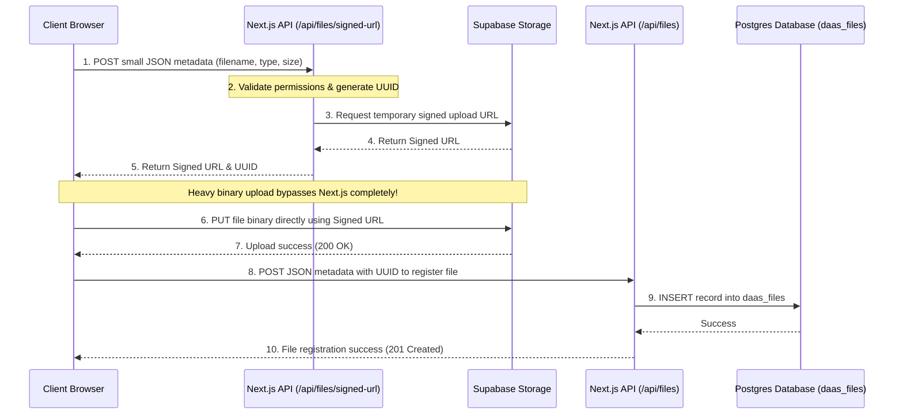

import { Callout, Steps } from "nextra/components";

# Files Module Recipe

The Files module is a ready-made `/files` experience on top of the
[Files API](/components#media-components). Instead of hand-building upload zones,
folder navigation, previews, and bulk actions, you scaffold the whole thing with
one command and own the code.

It gives you two screens:

- **`FileManager`** — the `/files` library: drag-and-drop upload, import-from-URL,
  folder navigation with breadcrumbs, grid/list views, search, multi-select, and
  bulk delete.
- **`FileDetail`** — the `/files/[id]` page: a **Preview** tab (image, video,
  audio, and PDF rendered inline) and a **Details** tab with an editable metadata
  form (title, description, tags, location, download filename), plus single delete.

## The pieces

| Piece         | Package                   | Role                                                                                   |
| ------------- | ------------------------- | -------------------------------------------------------------------------------------- |
| `FileManager` | `@buildpad/ui-files`      | The library view: upload, folders, grid/list, search, selection, bulk delete           |
| `FileDetail`  | `@buildpad/ui-files`      | The detail view: preview tabs + editable metadata form + delete                        |
| `Upload`      | `@buildpad/ui-interfaces` | The drag-and-drop / file-picker / import-from-URL affordance (reused by `FileManager`) |
| `useFiles`    | `@buildpad/hooks`         | Upload, list, get, update, delete, and import-from-URL operations                      |
| `useFolders`  | `@buildpad/hooks`         | List, create, rename, and delete folders                                               |

<Callout type="info">
  This recipe is **opt-in** — it is *not* part of `bootstrap`. Generate the `app/files/` module with `buildpad add
  files-routes`; it pulls in the `file-manager` component (which in turn pulls the `upload` component and the `types` /
  `hooks` / `services` lib modules). The code below is that generated module, shown so you understand the wiring. In a
  generated app the imports point at your local copies (`@/components/ui/file-manager`, `@/lib/buildpad/hooks`); when
  consuming the packages directly, import from `@buildpad/ui-files` and `@buildpad/hooks` instead.
</Callout>

## Install

<Steps>

### Add the module

```bash copy
buildpad add files-routes
```

This copies the page shells into `app/files/`, the component into
`components/ui/file-manager/`, the `upload` component into `components/ui/`, and
the `useFiles` / `useFolders` hooks into `lib/buildpad/hooks/`.

### Add the API routes

The module talks to your DaaS through proxy routes. If you haven't already added
them, run:

```bash copy
buildpad add api-routes
```

This includes the routes the module needs: `app/api/files/route.ts`,
`app/api/files/signed-url/route.ts`, `app/api/files/[id]/route.ts`,
`app/api/files/import/route.ts`, `app/api/folders/route.ts`,
`app/api/folders/[id]/route.ts`, and `app/api/assets/[id]/route.ts`.

</Steps>

## The routes

Three files give you the whole module:

```
app/files/
├── layout.tsx          # optional shell wrapper (centers content)
├── page.tsx            # /files       — the FileManager library view
└── [id]/page.tsx       # /files/[id]  — the FileDetail preview + metadata view
```

<Steps>

### The list view

`app/files/page.tsx` renders `FileManager` wired to the router so clicking a file
opens its detail page. Upload, folders, search, view toggle, and bulk delete are
all built in.

```tsx filename="app/files/page.tsx" copy
"use client";

import { useRouter } from "next/navigation";
import { FileManager } from "@/components/ui/file-manager";

export default function FilesPage() {
  const router = useRouter();

  return <FileManager onFileClick={(file) => router.push(`/files/${file.id}`)} />;
}
```

`FileManager` props: `onFileClick` (open a file), `pageSize` (default `24`),
`defaultView` (`'grid'` | `'list'`), and `enableFolders` (default `true` — set
`false` for a flat library with no folder UI).

### The detail view

`app/files/[id]/page.tsx` renders `FileDetail`, which fetches the file, shows the
Preview/Details tabs, saves metadata, and handles deletion.

```tsx filename="app/files/[id]/page.tsx" copy
"use client";

import { use } from "react";
import { useRouter } from "next/navigation";
import { FileDetail } from "@/components/ui/file-manager";

export default function FileDetailPage({ params }: { params: Promise<{ id: string }> }) {
  const { id } = use(params);
  const router = useRouter();

  return <FileDetail id={id} onBack={() => router.push("/files")} onDeleted={() => router.push("/files")} />;
}
```

</Steps>

## Upload flow (Presigned URL)

File uploads bypass Next.js server memory and bandwidth limits by uploading binary payloads directly to Supabase Storage using temporary presigned signed URLs.



### How it works

1.  **Request Signed URL (`POST /api/files/signed-url`)**: The client sends file metadata (e.g. filename, mime type, size). Next.js validates user authorization and generates a file UUID, then requests a temporary signed upload URL from Supabase Storage.
2.  **Direct Binary Upload (`PUT <signed-url>`)**: The client uploads the raw binary file directly to Supabase Storage via HTTP `PUT`. The heavy file payload completely bypasses Next.js API servers, preventing memory bottlenecks and timeouts.
3.  **Register Metadata (`POST /api/files`)**: Once the binary upload succeeds (200 OK), the client sends a lightweight JSON payload containing the UUID and metadata to register the file entry in the database (`daas_files`).

### Component upload handler example

Here is an example of implementing the presigned upload handler inside a custom component matching the API contracts (`uploadUrl`, `primaryKey`, `filenameDisk`, `storageBucket`):

```tsx filename="components/CustomUpload.tsx" copy
"use client";

import { useState } from "react";
import { Button, FileButton, Progress, Stack, Text } from "@mantine/core";
import { notifications } from "@mantine/notifications";

export function CustomUpload({
  currentFolder,
  onUploaded,
}: {
  currentFolder?: string | null;
  onUploaded?: () => void;
}) {
  const [uploading, setUploading] = useState(false);
  const [uploadProgress, setUploadProgress] = useState(0);

  const handleFileUpload = async (files: File[]) => {
    if (!files || files.length === 0) return;

    setUploading(true);
    setUploadProgress(0);
    let completedFiles = 0;
    const totalFiles = files.length;

    for (const file of files) {
      try {
        // 1. Get signed upload URL from Next.js API
        const signedUrlRes = await fetch("/api/files/signed-url", {
          method: "POST",
          headers: { "Content-Type": "application/json" },
          body: JSON.stringify({
            filename_download: file.name,
            type: file.type || "application/octet-stream",
            folder: currentFolder || undefined,
          }),
        });

        if (!signedUrlRes.ok) {
          const error = await signedUrlRes.json();
          throw new Error(error.errors?.[0]?.message || "Failed to get upload URL");
        }

        const { data: signedData } = await signedUrlRes.json();

        // 2. Upload file binary directly to Supabase Storage
        const uploadRes = await fetch(signedData.uploadUrl, {
          method: "PUT",
          headers: {
            "Content-Type": file.type || "application/octet-stream",
          },
          body: file,
        });

        if (!uploadRes.ok) {
          let errorMsg = `Upload failed with status ${uploadRes.status}`;
          try {
            const errText = await uploadRes.text();
            try {
              const errJson = JSON.parse(errText);
              errorMsg = errJson.message || errJson.error?.message || errJson.error || errText;
            } catch {
              errorMsg = errText || errorMsg;
            }
          } catch {}

          if (
            uploadRes.status === 413 ||
            errorMsg.includes("exceeds") ||
            errorMsg.includes("maximum allowed size") ||
            errorMsg.includes("EntityTooLarge") ||
            errorMsg.includes("Payload Too Large") ||
            errorMsg.includes("exceeded")
          ) {
            errorMsg = "File size exceeds the maximum limit configured in Supabase Storage.";
          }
          throw new Error(errorMsg);
        }

        // 3. Register file metadata in database (daas_files)
        const metadataRes = await fetch("/api/files", {
          method: "POST",
          headers: { "Content-Type": "application/json" },
          body: JSON.stringify({
            id: signedData.primaryKey,
            filename_download: file.name,
            type: file.type || "application/octet-stream",
            folder: currentFolder || undefined,
            filename_disk: signedData.filenameDisk,
            storage: signedData.storageBucket,
            filesize: file.size,
          }),
        });

        if (!metadataRes.ok) {
          const error = await metadataRes.json();
          throw new Error(error.errors?.[0]?.message || "Failed to save file metadata");
        }

        completedFiles++;
        setUploadProgress((completedFiles / totalFiles) * 100);
      } catch (error) {
        console.error("Upload error:", error);
        notifications.show({
          title: "Upload Failed",
          message: error instanceof Error ? error.message : `Failed to upload ${file.name}`,
          color: "red",
        });
      }
    }

    setUploading(false);
    onUploaded?.();
  };

  return (
    <Stack gap="sm">
      <FileButton onChange={(file) => file && handleFileUpload([file])} disabled={uploading}>
        {(props) => (
          <Button {...props} loading={uploading}>
            Upload via Presigned URL
          </Button>
        )}
      </FileButton>

      {uploading && (
        <Stack gap="xs">
          <Progress value={uploadProgress} animated />
          <Text size="xs" c="dimmed">
            Uploading directly to storage ({Math.round(uploadProgress)}%)...
          </Text>
        </Stack>
      )}
    </Stack>
  );
}
```

## The data layer

Both screens are thin — all the work lives in two hooks you can reuse anywhere.

`useFiles` returns `uploadFiles`, `fetchFiles`, `getFile`, `updateFile`,
`deleteFile`, `deleteFiles`, and `importFromUrl`. `updateFile` accepts the full
editable metadata set:

```tsx
const { updateFile } = useFiles();

await updateFile(fileId, {
  title: "Cover image",
  description: "Homepage hero",
  tags: ["marketing", "hero"],
  location: "HQ",
  filename_download: "hero.png",
});
```

`useFolders` returns `fetchFolders`, `createFolder`, `updateFolder`, and
`deleteFolder`. Scope a listing to a parent (pass `null` for root):

```tsx
const { fetchFolders, createFolder } = useFolders();

const rootFolders = await fetchFolders({ parent: null });
const folder = await createFolder({ name: "Campaigns", parent: null });
```

<Callout type="info">
Thumbnails and previews are served by `/api/assets/[id]`. Use `getAssetUrl(id, …)`
from `@/lib/buildpad/types` to build transform URLs — e.g.
`getAssetUrl(id, { width: 240, height: 240, fit: 'cover' })` for a grid thumbnail,
or `getAssetUrl(id, { download: true })` for a download link.
</Callout>

## Preview behaviour

The Preview tab renders inline based on MIME type:

| Type          | Behaviour                     |
| ------------- | ----------------------------- |
| Image         | `` rendered inline       |
| Video         | HTML5 `<video>` player        |
| Audio         | HTML5 `<audio>` player        |
| PDF           | Embedded `<iframe>`           |
| Anything else | File icon + a download button |

## Prerequisites

- The module must live under your authenticated layout so `DaaSProvider` is
  above it — `buildpad init` generates this as `app/(authenticated)/` with a
  `DaaSProviderWrapper`. The hooks call your `/api/files/*`, `/api/folders/*`,
  and `/api/assets/*` proxy routes.
- No extra styling is needed: the components consume the design tokens through
  the Mantine theme. See the [Styleguide](/styleguide) for the token reference.

## See the components live

Every state of the Files module is in the Files Storybook — `FileManager`,
`FileDetail`, `FilePreview`, and the supporting pieces. Run it locally with
`pnpm --filter @buildpad/ui-files storybook` (port 6009). The
`FileManager (DaaS)` story connects to a real DaaS instance through the
storybook-host proxy.
